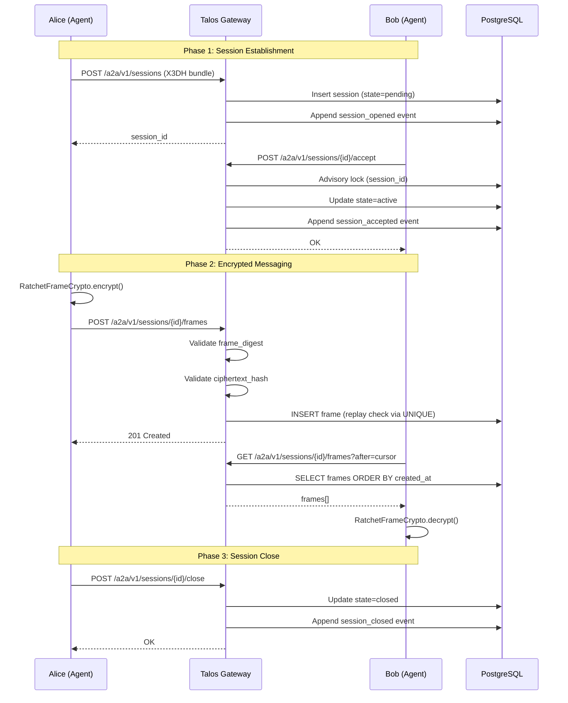
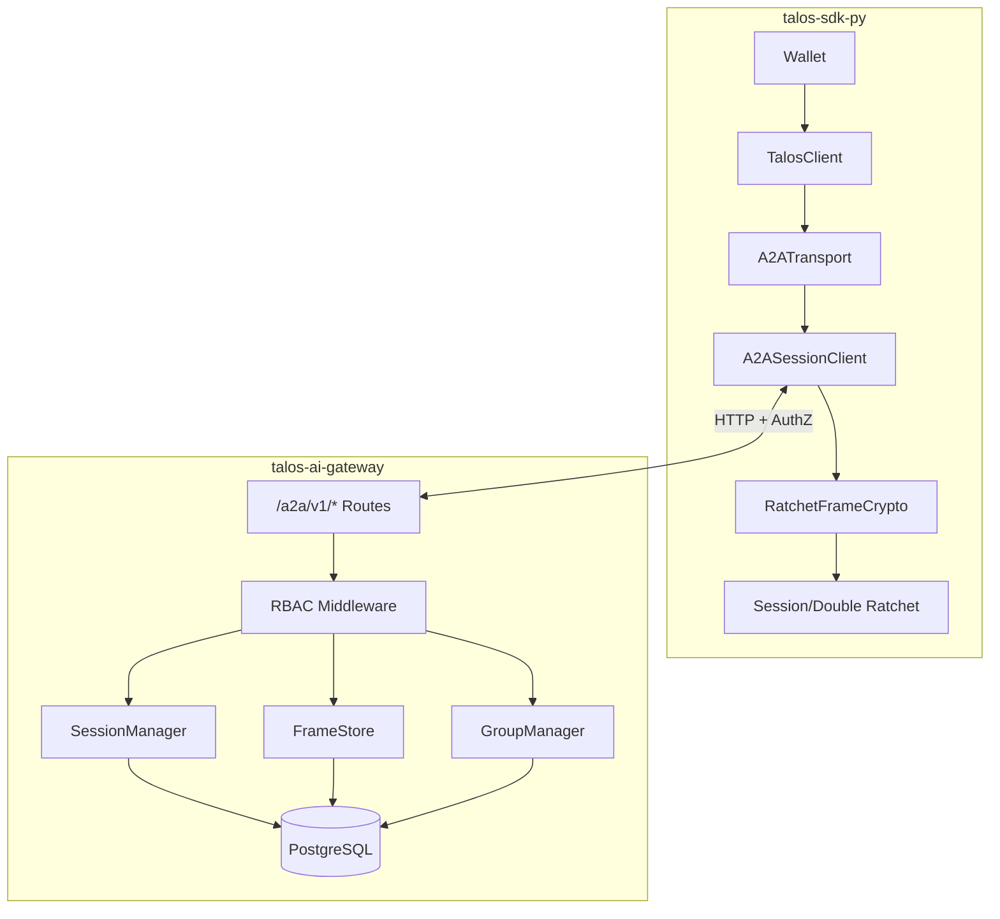
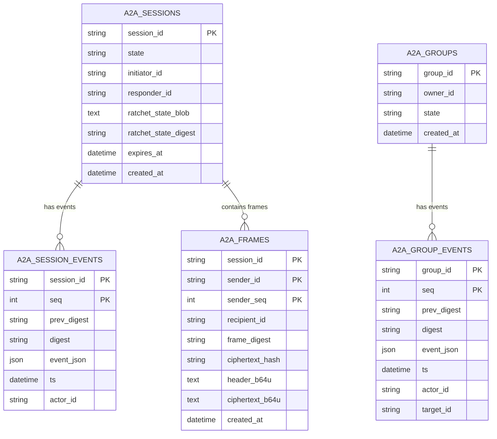

# A2A Architecture Diagram

This document provides visual architecture diagrams for Phase 10 A2A communication.

## A2A Session Flow

## Data Flow Architecture

## Database Schema

## Security Properties

| Property           | Implementation                            |
| ------------------ | ----------------------------------------- |
| Forward Secrecy    | Double Ratchet (per-message keys)         |
| Replay Protection  | UNIQUE(session_id, sender_id, sender_seq) |
| Integrity          | frame_digest = SHA256(canonical preimage) |
| Ciphertext Binding | ciphertext_hash = SHA256(ciphertext)      |
| Single-Writer      | pg_try_advisory_xact_lock                 |
| Concurrent Access  | Fails with A2A_LOCK_CONTENTION            |
