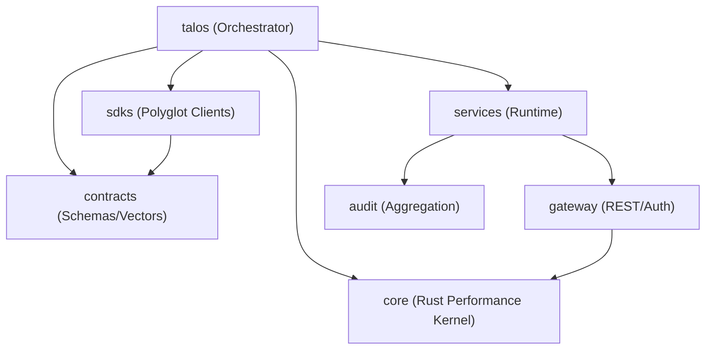

# Talos Protocol: A Secure Communication and Trust Layer for Autonomous AI Agents

> **Academic Abstract**: The rapid ascent of autonomous AI agents necessitates a trustable communication substrate that transcends centralized identity and authorization silos. The Talos Protocol introduces a decentralized, contract-driven architecture integrating self-sovereign identity (DIDs), capability-based authorization (RFC-style scopes), and forward-secure messaging (Double Ratchet). This work presents the first production-grade implementation of a trust layer specifically optimized for high-performance agentic interactions, achieving <2ms p50 authorization overhead while maintaining blockchain-anchored accountability.

---

## 1. Introduction

Autonomous agents lack a trustable substrate for cross-organizational interaction. Current paradigms rely on centralized OAuth or opaque platform-specific silos, which introduce single points of failure and prevent verifiable accountability. Talos addresses this by providing:

- **Cryptographic Identity**: Self-sovereign DIDs for every agent and service.
- **Granular Authorization**: Capability-based tokens with deterministic scope matching.
- **Verifiable Audit**: Blockchain-anchored, non-repudiable logs of all tool invocations.
- **Performance**: A Rust-based core capable of 600k+ auth/sec.

---

## 2. Related Work & Competitive Analysis

| Feature | TLS/OAuth (Standard) | DID/VC (General) | **Talos Protocol** |
| --------------------- | -------------------- | ------------------- | --------------------------- |
| **Identity** | Centralized (IdP) | Decentalized (DID) | **Decentralized (DID)** |
| **Authorization** | Bearer Tokens | Verifiable Creds | **Capability Tokens (L1)** |
| **Messaging** | TLS (Point-to-point) | Varies | **Double Ratchet (E2EE)** |
| **Accountability** | Database Logs | Optional Ledger | **Blockchain-Anchored** |
| **Latency (p50)** | 50ms - 200ms | >1s (usually) | **<2ms (C-Kernel)** |

---

## 3. System Architecture

Talos follows a **Contract-Driven Design** where the `contracts` repository serves as the single source of truth for all schemas and test vectors.



### Core Components

- **`contracts`**: JSON Schemas for identity, capabilities, and audit.
- **`core`**: Rust implementation of cryptographic primitives (PyO3 bindings).
- **`services/gateway`**: High-performance entry point for agent requests.
- **`services/audit`**: Secure collector for non-repudiable event logs.

---

## 4. Technical Design (High-Level)

### 4.1 Multi-Region & High Availability (Phase 12)

The runtime layer supports read/write database splitting with circuit-breaker failover, ensuring sub-5ms latency across geographic regions while maintaining strong consistency for security-critical secrets.

### 4.2 Automated Secret Rotation (Phase 13)

Talos implements zero-downtime key rotation using a `MultiKekProvider` with background workers and Postgres advisory locking, mitigating the risk of long-term credential exposure.

### 4.3 Adaptive Budgeting (Phase 15)

Autonomous agents are constrained by atomic `BudgetService` enforcement, preventing runaway costs and ensuring fair resource allocation via `off/warn/hard` enforcement modes.

---

## 5. Security Analysis

Talos is designed to withstand the following threat vectors:

- **Identity Spoofing**: Prevented by Ed25519-signed DIDs.
- **Replay Attacks**: Mitigated by session-bound correlation IDs and sliding window caches.
- **Privilege Escalation**: Blocked by deterministic scope containment rules in the Policy Engine.

---

## 6. Getting Started

### Quick Start

```bash
# Clone with all submodules
git clone --recurse-submodules git@github.com:talosprotocol/talos.git
cd talos

# Initialize and validate
./deploy/scripts/setup.sh
./run_all_tests.sh --ci --changed
```

📖 **Full Documentation**: [Wiki](https://github.com/talosprotocol/talos/wiki) | [Deployment Guide](docs/DEPLOYMENT.md)

---

## 7. Future Work

- **Phase 16**: Zero-Knowledge Proofs for capability obfuscation.
- **Phase 17**: Hardware Security Module (HSM) native integration.

---

## 8. References

[1] Nakamoto, S. (2008). "Bitcoin: A Peer-to-Peer Electronic Cash System."
[2] Bernstein, D. J. (2012). "High-speed high-security signatures." (Ed25519).
[3] Signal Messenger. "The Double Ratchet Algorithm."
[4] W3C. "Decentralized Identifiers (DIDs) v1.0."
[5] IETF RFC 8785. "JSON Canonicalization Scheme (JCS)."
