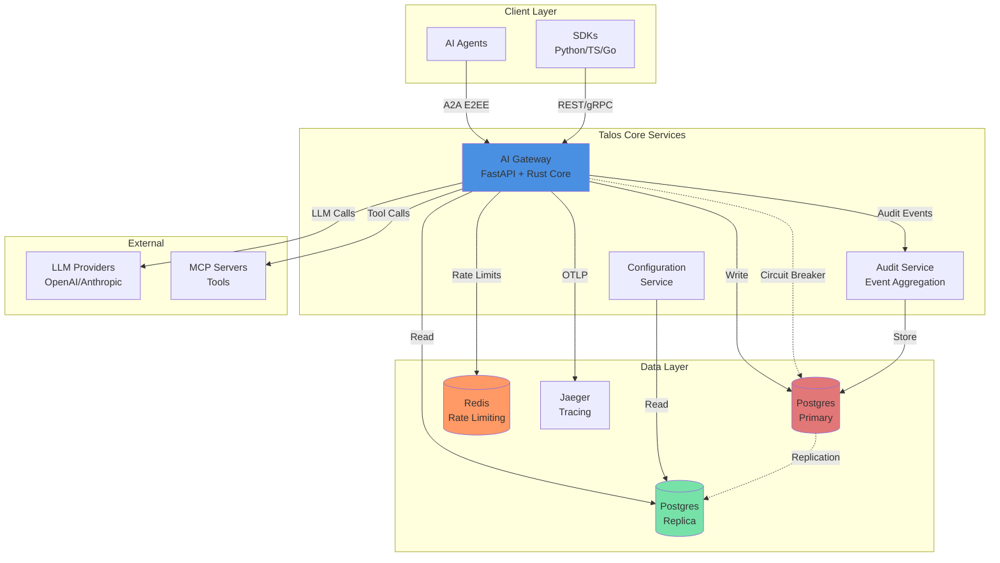

# Talos Protocol: A Secure Communication and Trust Layer for Autonomous AI Agents

> **Academic Abstract**: The rapid ascent of autonomous AI agents necessitates a trustable communication substrate that transcends centralized identity and authorization silos. The Talos Protocol introduces a decentralized, contract-driven architecture integrating self-sovereign identity (DIDs), capability-based authorization (RFC-style scopes), and forward-secure messaging (Double Ratchet). This work presents the first production-grade implementation of a trust layer specifically optimized for high-performance agentic interactions, achieving <2ms p50 authorization overhead while maintaining blockchain-anchored accountability.

---

## 1. Introduction

Autonomous agents lack a trustable substrate for cross-organizational interaction. Current paradigms rely on centralized OAuth or opaque platform-specific silos, which introduce single points of failure and prevent verifiable accountability. Talos addresses this by providing:

- **Cryptographic Identity**: Self-sovereign DIDs for every agent and service.
- **Granular Authorization**: Capability-based tokens with deterministic scope matching.
- **Agent-to-Agent Communication**: Forward-secret channels with Double Ratchet encryption (Phase 10).
- **Production Hardening**: Rate limiting, distributed tracing, health checks, graceful shutdown (Phase 11).
- **Verifiable Audit**: Blockchain-anchored, non-repudiable logs of all tool invocations.
- **Performance**: A Rust-based core capable of 600k+ auth/sec with <2ms p50 latency.

---

## 2. Related Work & Competitive Analysis

| Feature | TLS/OAuth (Standard) | DID/VC (General) | **Talos Protocol** |
| :--- | :--- | :--- | :--- |
| **Identity** | Centralized (IdP) | Decentalized (DID) | **Decentralized (DID)** |
| **Authorization** | Bearer Tokens | Verifiable Creds | **Capability Tokens (L1)** |
| **Messaging** | TLS (Point-to-point) | Varies | **Double Ratchet (E2EE)** |
| **Rate Limiting** | Basic (if any) | None | **Token Bucket + Redis** |
| **Observability** | Basic Metrics | Varies | **OpenTelemetry + Redaction** |
| **Accountability** | Database Logs | Optional Ledger | **Blockchain-Anchored** |
| **Latency (p50)** | 50ms - 200ms | >1s (usually) | **<2ms (C-Kernel)** |

---

## 3. System Architecture

Talos follows a **Contract-Driven Design** where the `contracts` repository serves as the single source of truth for all schemas and test vectors.

**Non-negotiable**: this project is contract-first; protocol logic and validation must come from published `contracts` artifacts, not re-implemented in consumers.

### System Architecture Overview



### Production Features (Phases 7-15)

| Phase | Feature | Status |
| ----- | ------- | ------ |
| **Phase 7** | RBAC Enforcement | ✅ |
| **Phase 9.2** | Tool Read/Write Separation | ✅ |
| **Phase 9.3** | Runtime Resilience (TGA) | ✅ |
| **Phase 10** | A2A Encrypted Channels | ✅ |
| **Phase 11** | Rate Limiting, Tracing, Health Checks | ✅ |
| **Phase 12** | Multi-Region (Circuit Breaker) | ✅ |
| **Phase 13** | Secrets Rotation (Multi-KEK) | ✅ |
| **Phase 15** | Adaptive Budgets | ✅ |

### Core Components

- **`contracts`**: JSON Schemas for identity, capabilities, and audit.
- **`core`**: Rust implementation of cryptographic primitives (PyO3 bindings).
- **`services/gateway`**: High-performance entry point for agent requests.
- **`services/audit`**: Secure collector for non-repudiable event logs.

---

## 4. Technical Design (High-Level)

### 4.1 Agent-to-Agent Communication Channels (Phase 10)

Talos enables secure, forward-secret communication between autonomous agents via **A2A Channels**. Built on the Signal Double Ratchet protocol, A2A sessions provide:

- **Session Lifecycle**: Create, accept, and rotate sessions with ratchet state persistence
- **Frame Encryption**: Authenticated encryption with replay protection and sequence tracking
- **Group Messaging**: Multi-party secure channels with membership management
- **API Surface**: RESTful endpoints (`/a2a/sessions`, `/a2a/frames`, `/a2a/groups`)

Each frame includes a `ciphertext_hash` for integrity verification and `sender_seq`/`recipient_seq` for strict ordering guarantees.

### 4.2 Production Hardening (Phase 11)

The Gateway implements enterprise-grade reliability features:

- **Rate Limiting**: Token bucket algorithm with Redis backend, surface-specific limits, fail-closed in production
- **Distributed Tracing**: OpenTelemetry integration with automatic redaction of sensitive data (Authorization headers, A2A frames, secrets)
- **Health Checks**: `/health/live` (always available) and `/health/ready` (dependency validation)
- **Graceful Shutdown**: Request draining, background task cleanup, zero-downtime deployments

All features enforce strict fail-closed behavior in production mode per Phase 11 specification.

### 4.3 Multi-Region & High Availability (Phase 12)

The runtime layer supports read/write database splitting with circuit-breaker failover, ensuring sub-5ms latency across geographic regions while maintaining strong consistency for security-critical secrets.

### 4.4 Automated Secret Rotation (Phase 13)

Talos implements zero-downtime key rotation using a `MultiKekProvider` with background workers and Postgres advisory locking, mitigating the risk of long-term credential exposure.

### 4.5 Adaptive Budgeting (Phase 15)

Autonomous agents are constrained by atomic `BudgetService` enforcement, preventing runaway costs and ensuring fair resource allocation via `off/warn/hard` enforcement modes.

---

## 5. Security Analysis

Talos is designed to withstand the following threat vectors:

- **Identity Spoofing**: Prevented by Ed25519-signed DIDs.
- **Replay Attacks**: Mitigated by session-bound correlation IDs and sliding window caches.
- **Privilege Escalation**: Blocked by deterministic scope containment rules in the Policy Engine.

---

## 6. Getting Started

### Quick Start

```bash
./scripts/bootstrap.sh
docker-compose up -d
```

### Table of Services

| Service | Port | Description |
| :--- | :--- | :--- |
| Gateway | 8000 | Identity & Policy Enforcement |
| AI Gateway | 8001 | LLM Orchestration & Safety |
| Audit Service | 8002 | Tamper-proof Logging |
| Config Service | 8003 | Centralized Policy Management |
| Dashboard | 3000 | Admin UI Control Plane |

📖 **Full Documentation**: [Documentation](docs/README.md) | [Deployment Guide](docs/guides/deployment.md)

---

## 7. Production Status

### Completed Phases (Production-Ready) ✅

- **Phase 7**: RBAC Enforcement with policy engine
- **Phase 9.2**: Tool Servers Read/Write Separation
- **Phase 9.3**: Runtime Loop and Resilience with TGA
- **Phase 10**: A2A Communication Channels (Double Ratchet E2EE)
- **Phase 11**: Production Hardening (rate limiting, tracing, health checks, graceful shutdown)
- **Phase 12**: Multi-Region Architecture (read/write splitting, circuit breaker)
- **Phase 13**: Secrets Rotation Automation (atomic updates, advisory locks, Multi-KEK)
- **Phase 15**: Adaptive Budgets (Redis Lua, atomic enforcement)

### Future Work

- **Phase 14**: Global Load Balancing (infrastructure-level via Ingress/Service Mesh)
- **Phase 16**: Zero-Knowledge Proofs for capability obfuscation
- **Phase 17**: Hardware Security Module (HSM) native integration

---

## 8. References

- [1] Nakamoto, S. (2008). "Bitcoin: A Peer-to-Peer Electronic Cash System."
- [2] Bernstein, D. J. (2012). "High-speed high-security signatures." (Ed25519).
- [3] Signal Messenger. "The Double Ratchet Algorithm."
- [4] W3C. "Decentralized Identifiers (DIDs) v1.0."
- [5] IETF RFC 8785. "JSON Canonicalization Scheme (JCS)."

---

## 9. License

This project is licensed under the Apache License, Version 2.0. See the [LICENSE](LICENSE) file for details.
