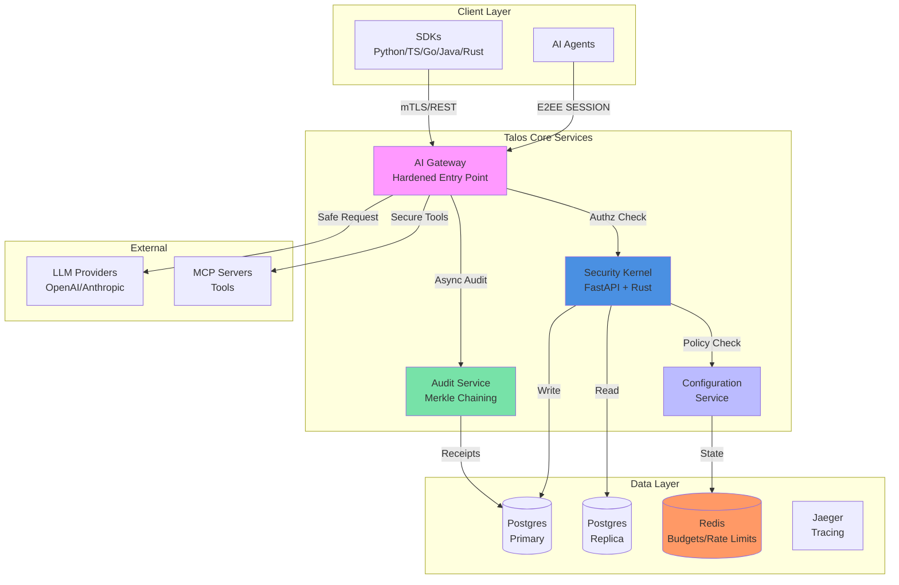

# Talos Protocol: A Secure Communication and Trust Layer for Autonomous AI Agents

> **Academic Abstract**: The rapid ascent of autonomous AI agents necessitates a trustable communication substrate that transcends centralized identity and authorization silos. The Talos Protocol introduces a decentralized, contract-driven architecture integrating self-sovereign identity (DIDs), capability-based authorization (RFC-style scopes), and forward-secure messaging (Double Ratchet). This work presents the first production-grade implementation of a trust layer specifically optimized for high-performance agentic interactions, achieving <2ms p50 authorization overhead while maintaining blockchain-anchored accountability.

---

## 1. Introduction

Autonomous agents lack a trustable substrate for cross-organizational interaction. Current paradigms rely on centralized OAuth or opaque platform-specific silos, which introduce single points of failure and prevent verifiable accountability. Talos addresses this by providing:

- **Cryptographic Identity**: Self-sovereign DIDs for every agent and service.
- **Granular Authorization**: Capability-based tokens with deterministic scope matching.
- **Agent-to-Agent Communication**: Forward-secret channels with Double Ratchet encryption.
- **Production Hardening**: Rate limiting, distributed tracing, health checks, and graceful shutdown.
- **Verifiable Audit**: Blockchain-anchored, non-repudiable logs of all tool invocations.
- **Performance**: A Rust-based core capable of 600k+ auth/sec with <2ms p50 latency.

---

## 2. Related Work & Competitive Analysis

| Feature            | TLS/OAuth (Standard) | DID/VC (General)   | **Talos Protocol**            |
| :----------------- | :------------------- | :----------------- | :---------------------------- |
| **Identity**       | Centralized (IdP)    | Decentalized (DID) | **Decentralized (DID)**       |
| **Authorization**  | Bearer Tokens        | Verifiable Creds   | **Capability Tokens (L1)**    |
| **Messaging**      | TLS (Point-to-point) | Varies             | **Double Ratchet (E2EE)**     |
| **Rate Limiting**  | Basic (if any)       | None               | **Token Bucket + Redis**      |
| **Observability**  | Basic Metrics        | Varies             | **OpenTelemetry + Redaction** |
| **Accountability** | Database Logs        | Optional Ledger    | **Blockchain-Anchored**       |
| **Latency (p50)**  | 50ms - 200ms         | >1s (usually)      | **<2ms (C-Kernel)**           |

---

## 3. System Architecture

Talos follows a **Contract-Driven Design** where the `contracts` repository serves as the single source of truth for all schemas and test vectors.

**Non-negotiable**: this project is contract-first; protocol logic and validation must come from published `contracts` artifacts, not re-implemented in consumers.

### System Architecture Overview


```mermaid
graph TB
    subgraph "Client Layer"
        Agent[AI Agents]
        SDK[SDKs<br/>Python/TS/Go/Java/Rust]
    end

    subgraph "Talos Core Services"
        Gateway[AI Gateway<br/>Hardened Entry Point]
        Audit[Audit Service<br/>Merkle Chaining]
        Config[Configuration<br/>Service]
        Core[Security Kernel<br/>FastAPI + Rust]
    end

    subgraph "Data Layer"
        PG_Primary[(Postgres<br/>Primary)]
        PG_Replica[(Postgres<br/>Replica)]
        Redis[(Redis<br/>Budgets/Rate Limits)]
        Jaeger[Jaeger<br/>Tracing]
    end

    subgraph "External"
        LLM[LLM Providers<br/>OpenAI/Anthropic]
        MCP[MCP Servers<br/>Tools]
    end

    Agent -->|E2EE SESSION| Gateway
    SDK -->|mTLS/REST| Gateway
    Gateway -->|Authz Check| Core
    Core -->|Policy Check| Config
    Gateway -->|Async Audit| Audit
    Gateway -->|Safe Request| LLM
    Gateway -->|Secure Tools| MCP

    Core -->|Write| PG_Primary
    Core -->|Read| PG_Replica
    Config -->|State| Redis
    Audit -->|Receipts| PG_Primary

    style Gateway fill:#f9f
    style Core fill:#4a90e2
    style Config fill:#bbf
    style Audit fill:#77e2a8
    style Redis fill:#ff9966
```

### Production Features (Phases 7-15)

| Phase         | Feature                               | Status |
| :------------ | :------------------------------------ | :----- |
| **Phase 7**   | RBAC Enforcement                      | ✅     |
| **Phase 9.2** | Tool Read/Write Separation            | ✅     |
| **Phase 9.3** | Runtime Resilience (TGA)              | ✅     |
| **Phase 10**  | A2A Encrypted Channels                | ✅     |
| **Phase 11**  | Rate Limiting, Tracing, Health Checks | ✅     |
| **Phase 12**  | Multi-Region (Circuit Breaker)        | ✅     |
| **Phase 13**  | Secrets Rotation (Multi-KEK)          | ✅     |
| **Phase 15**  | Adaptive Budgets                      | ✅     |

### Core Components

- **`contracts`**: JSON Schemas for identity, capabilities, and audit.
- **`core`**: Rust implementation of cryptographic primitives (PyO3 bindings).
- **`services/ai-gateway`**: Hardened, production-ready entry point for agent requests.
- **`services/audit`**: Secure collector for non-repudiable event logs.

---

## 4. Technical Design (High-Level)

### 4.1 Public A2A v1 Surface and Secure Channels

Talos exposes the public A2A contract through a standards-first Agent Card plus JSON-RPC task surface:

- **Discovery**: `/.well-known/agent-card.json` and `/extendedAgentCard`
- **RPC Surface**: `/rpc` with canonical methods such as `SendMessage`, `ListTasks`, and `SubscribeToTask`
- **Authorization**: method-level A2A scopes resolved from the shared contract inventory

### 4.2 Production Hardening (Phase 11)

The AI Gateway implements enterprise-grade reliability features:

- **Rate Limiting**: Token bucket algorithm with Redis backend.
- **Distributed Tracing**: OpenTelemetry integration with automatic redaction.
- **Health Checks**: `/health/live` and `/health/ready`.
- **Graceful Shutdown**: Request draining and background task cleanup.

### 4.3 Multi-Region & High Availability (Phase 12)

The runtime layer supports read/write database splitting with circuit-breaker failover, ensuring sub-5ms latency across geographic regions.

---

## 6. Getting Started

### Quick Start

```bash
./start.sh
```

### Table of Services

| Service         | Port | Description                      |
| :-------------- | :--- | :------------------------------- |
| AI Gateway      | 8000 | Production Entry Point (Ingress) |
| Audit Service   | 8001 | Tamper-proof Logging & Merkle    |
| MCP Connector   | 8082 | MCP Protocol Bridge              |
| Secure Chat     | 8090 | Demo Chat Agent                  |
| Dashboard       | 3000 | Admin UI Control Plane           |

📖 **Full Documentation**: [Documentation](docs/README.md) | [Deployment Guide](docs/guides/deployment.md)

---

## 7. Production Status

### Completed Phases (Production-Ready) ✅

- **Phase 7**: RBAC Enforcement with policy engine
- **Phase 9.2**: Tool Servers Read/Write Separation
- **Phase 9.3**: Runtime Loop and Resilience with TGA
- **Phase 10**: A2A Communication Channels (Double Ratchet E2EE)
- **Phase 11**: Production Hardening (rate limiting, tracing, health checks)
- **Phase 12**: Multi-Region Architecture (read/write splitting, circuit breaker)
- **Phase 13**: Secrets Rotation Automation (Multi-KEK)
- **Phase 15**: Adaptive Budgets (Atomic enforcement)

---

## 11. License

This project is licensed under the Apache License, Version 2.0. See the [LICENSE](LICENSE) file for details.
