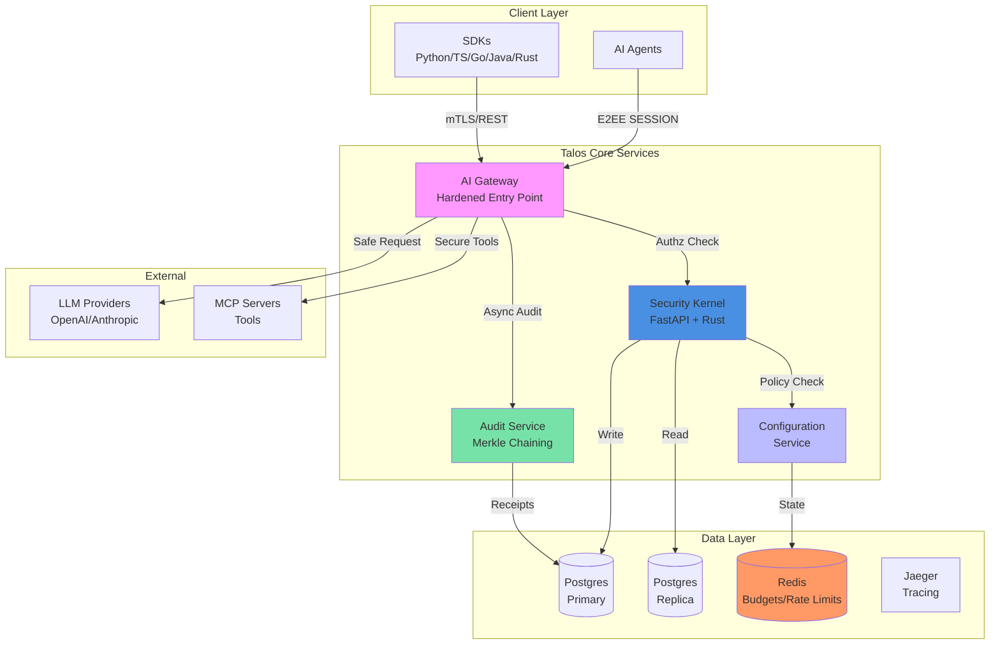

# Talos Protocol: A Secure Communication and Trust Layer for Autonomous AI Agents

> Talos is a contract-driven platform for agent identity, authorization, messaging, and audit. This repository combines protocol contracts, language SDKs, gateway services, deployment configurations, and conformance tests. Security and performance properties depend on the specific implementation and deployment profile; see the linked contracts and verification results before relying on a system-level guarantee.

---

## 1. Introduction

Autonomous agents lack a trustable substrate for cross-organizational interaction. Current paradigms rely on centralized OAuth or opaque platform-specific silos, which introduce single points of failure and prevent verifiable accountability. Talos addresses this by providing:

- **Cryptographic Identity**: Self-sovereign DIDs for every agent and service.
- **Granular Authorization**: Capability-based tokens with deterministic scope matching.
- **Agent-to-Agent Communication**: Forward-secret channels with Double Ratchet encryption.
- **Production Hardening**: Rate limiting, distributed tracing, health checks, and graceful shutdown.
- **Verifiable Audit**: Audit events and Merkle proof support; external anchoring is deployment-dependent and is not enabled by the default Compose profile.
- **Performance**: Rust and Python components are available; throughput and latency must be measured for the selected build and deployment.

---

## 2. Related Work & Competitive Analysis

| Feature            | TLS/OAuth (Standard) | DID/VC (General)   | **Talos Protocol**            |
| :----------------- | :------------------- | :----------------- | :---------------------------- |
| **Identity**       | Centralized (IdP)    | Decentalized (DID) | **Decentralized (DID)**       |
| **Authorization**  | Bearer Tokens        | Verifiable Creds   | **Capability Tokens (L1)**    |
| **Messaging**      | TLS (Point-to-point) | Varies             | **Double Ratchet (E2EE)**     |
| **Rate Limiting**  | Basic (if any)       | None               | **Token Bucket + Redis**      |
| **Observability**  | Basic Metrics        | Varies             | **OpenTelemetry + Redaction** |
| **Accountability** | Database Logs        | Optional Ledger    | **Audit and Merkle support; external anchoring deployment-dependent** |
| **Latency**        | Workload-dependent   | Workload-dependent | **Measure for the selected deployment** |

---

## 3. System Architecture

Talos follows a **Contract-Driven Design** where the `contracts` repository serves as the single source of truth for all schemas and test vectors.

**Non-negotiable**: this project is contract-first; protocol logic and validation must come from published `contracts` artifacts, not re-implemented in consumers.

### System Architecture Overview


```mermaid
graph TB
    subgraph "Client Layer"
        Agent[AI Agents]
        SDK[SDKs<br/>Python/TS/Go/Java/Rust]
    end

    subgraph "Talos Core Services"
        Gateway[AI Gateway<br/>Hardened Entry Point]
        Audit[Audit Service<br/>Merkle Chaining]
        Config[Configuration<br/>Service]
        Core[Security Kernel<br/>FastAPI + Rust]
    end

    subgraph "Data Layer"
        PG_Primary[(Postgres<br/>Primary)]
        PG_Replica[(Postgres<br/>Replica)]
        Redis[(Redis<br/>Budgets/Rate Limits)]
        Jaeger[Jaeger<br/>Tracing]
    end

    subgraph "External"
        LLM[LLM Providers<br/>OpenAI/Anthropic]
        MCP[MCP Servers<br/>Tools]
    end

    Agent -->|E2EE SESSION| Gateway
    SDK -->|mTLS/REST| Gateway
    Gateway -->|Authz Check| Core
    Core -->|Policy Check| Config
    Gateway -->|Async Audit| Audit
    Gateway -->|Safe Request| LLM
    Gateway -->|Secure Tools| MCP

    Core -->|Write| PG_Primary
    Core -->|Read| PG_Replica
    Config -->|State| Redis
    Audit -->|Receipts| PG_Primary

    style Gateway fill:#f9f
    style Core fill:#4a90e2
    style Config fill:#bbf
    style Audit fill:#77e2a8
    style Redis fill:#ff9966
```

### Production Features (Phases 7-15)

| Phase         | Feature                               | Status |
| :------------ | :------------------------------------ | :----- |
| **Phase 7**   | RBAC Enforcement                      | ✅     |
| **Phase 9.2** | Tool Read/Write Separation            | ✅     |
| **Phase 9.3** | Runtime Resilience (TGA)              | ✅     |
| **Phase 10**  | A2A Encrypted Channels                | ✅     |
| **Phase 11**  | Rate Limiting, Tracing, Health Checks | ✅     |
| **Phase 12**  | Multi-Region (Circuit Breaker)        | ✅     |
| **Phase 13**  | Secrets Rotation (Multi-KEK)          | ✅     |
| **Phase 15**  | Adaptive Budgets                      | ✅     |

### Core Components

- **`contracts`**: JSON Schemas for identity, capabilities, and audit.
- **`core`**: Rust implementation of cryptographic primitives (PyO3 bindings).
- **`services/ai-gateway`**: AI request gateway with authentication, policy, and audit components.
- **`services/audit`**: Audit event collector with hash-chain and Merkle proof support; event completeness and durable delivery depend on configuration.

---

## 4. Technical Design (High-Level)

### 4.1 Public A2A v1 Surface and Secure Channels

Talos exposes the public A2A contract through a standards-first Agent Card plus JSON-RPC task surface:

- **Discovery**: `/.well-known/agent-card.json` and `/extendedAgentCard`
- **RPC Surface**: `/rpc` with canonical methods such as `SendMessage`, `ListTasks`, and `SubscribeToTask`
- **Authorization**: method-level A2A scopes resolved from the shared contract inventory

### 4.2 Production Hardening (Phase 11)

The AI Gateway implements enterprise-grade reliability features:

- **Rate Limiting**: Token bucket algorithm with Redis backend.
- **Distributed Tracing**: OpenTelemetry integration with automatic redaction.
- **Health Checks**: `/health/live` and `/health/ready`.
- **Graceful Shutdown**: Request draining and background task cleanup.

### 4.3 Multi-Region & High Availability (Phase 12)

The runtime layer supports read/write database splitting with circuit-breaker failover, ensuring sub-5ms latency across geographic regions.

---

## 6. Getting Started

### Quick Start

```bash
./start.sh
```

### Table of Services

| Service         | Port | Description                      |
| :-------------- | :--- | :------------------------------- |
| Gateway Ingress | 8000 | Public local Envoy entry point   |
| AI Gateway      | 8001 | Direct local AI Gateway process  |
| Audit Service   | 8002 | Audit events and Merkle proofs   |
| Config Service  | 8003 | Configuration Control Plane      |
| MCP Connector   | 8082 | MCP Protocol Bridge              |
| Terminal Adapter| 8083 | Secure Terminal Management       |
| Dashboard       | 3000 | Admin UI Control Plane           |

📖 **Full Documentation**: [Documentation](https://github.com/talosprotocol/talos-docs) | [Deployment Guide](https://github.com/talosprotocol/talos-docs/blob/main/guides/deployment.md)

The canonical local host and container port map is maintained in [`deploy/service-ports.json`](deploy/service-ports.json).

---

## 7. Production Status

### Declared implementation phases

The phase labels below describe implementation milestones. They do not certify a complete deployment as production-ready; see the [remediation plan](docs/audits/2026-10-07-talos-remediation-implementation-plan.md) for verified limits and current gates.

- **Phase 7**: RBAC Enforcement with policy engine
- **Phase 9.2**: Tool Servers Read/Write Separation
- **Phase 9.3**: Runtime Loop and Resilience with TGA
- **Phase 10**: A2A Communication Channels (Double Ratchet E2EE)
- **Phase 11**: Production Hardening (rate limiting, tracing, health checks)
- **Phase 12**: Multi-Region Architecture (read/write splitting, circuit breaker)
- **Phase 13**: Secrets Rotation Automation (Multi-KEK)
- **Phase 15**: Adaptive Budgets (Atomic enforcement)

---

## 11. License

This project is licensed under the Apache License, Version 2.0. See the [LICENSE](LICENSE) file for details.
