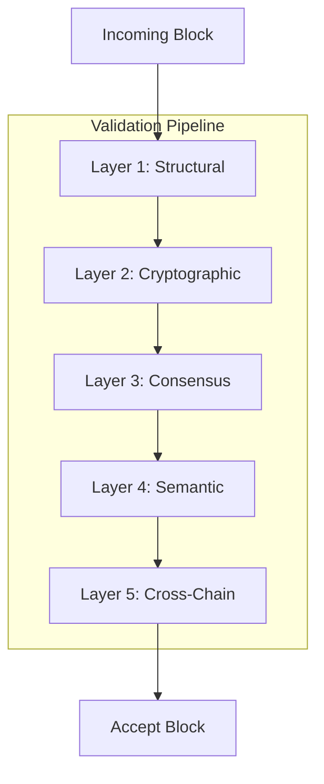

# Talos Protocol

> **Secure, Decentralized Communication for the AI Agent Era**

[](https://www.python.org/downloads/)
[](https://opensource.org/licenses/MIT)
[](#testing)
[](#testing)

## v2.0.0 Features

| Feature | Status | Description |
|---------|--------|-------------|
| 🔄 **Double Ratchet** | ✅ | Signal protocol for per-message forward secrecy |
| ✅ **Validation Engine** | ✅ | 5-layer block validation with audit reports |
| 🔒 **Fine-Grained ACLs** | ✅ | Tool/resource permissions per peer |
| 📦 **Python SDK** | ✅ | Clean `TalosClient` and `SecureChannel` API |
| 💡 **Light Client** | ✅ | SPV proof verification, ~99% storage reduction |
| 🆔 **DIDs/DHT** | ✅ | W3C DIDs with Kademlia peer discovery |
| ⚡ **Enterprise Performance** | ✅ | Batch crypto, LMDB storage, Parallel validation |
| ship **Infrastructure** | ✅ | Docker, Docker Compose, Helm charts |

```python
# Quick Example
from talos import TalosClient

async with TalosClient.create("my-agent") as client:
    await client.establish_session(peer_id, peer_bundle)
    await client.send(peer_id, b"Hello with forward secrecy!")
```

📖 **[Documentation Wiki](https://github.com/nileshchakraborty/talos/wiki)** | 📚 **[Examples](examples/)** | 📋 **[CHANGELOG](CHANGELOG.md)** | 🗺️ **[Roadmap](docs/ROADMAP_v2.md)**

---

## Abstract

**Talos** is a novel cryptographic protocol designed to secure **Model Context Protocol (MCP)** communication over a decentralized blockchain network. It addresses the critical need for secure, non-repudiable, and censorship-resistant communication channels between AI Agents and their biological or digital counterparts. By integrating peer-to-peer (P2P) messaging with distributed ledger technology, Talos eliminates centralized points of failure while ensuring that every tool invocation and data exchange is cryptographically verified and permanently audited.

The architecture is designed to be the foundational security layer for autonomous agent fleets.

---

## Table of Contents

- [Introduction](#introduction)
- [Related Work](#related-work)
- [System Architecture](#system-architecture)
- [Cryptographic Design](#cryptographic-design)
- [Protocol Specification](#protocol-specification)
- [Scalability Considerations](#scalability-considerations)
- [Installation](#installation)
- [Usage](#usage)
- [MCP Integration](#mcp-integration)
- [Evaluation](#evaluation)
- [Documentation](#documentation)
- [Future Work](#future-work)
- [References](#references)

---

## Introduction

### Problem Statement

Centralized messaging platforms present several fundamental challenges:

1. **Single Point of Failure**: Server outages can disrupt communication for millions of users [1]
2. **Privacy Concerns**: Centralized storage creates attractive targets for data breaches [2]
3. **Censorship Vulnerability**: Central authorities can restrict or monitor communications [3]
4. **Trust Requirements**: Users must trust platform operators with their metadata and, in some cases, message content [4]

### Our Contribution

BMP addresses these challenges by:

- **Decentralizing message routing** through a P2P gossip protocol based on libp2p design principles [5]
- **Ensuring message integrity** via blockchain-based immutable logging with Merkle tree verification [6]
- **Providing end-to-end encryption** using modern elliptic curve cryptography (Ed25519/X25519) [7]
- **Enabling non-repudiation** through digital signatures on all transmitted messages [8]

---

## Related Work

### Blockchain-Based Messaging Systems

Several prior works have explored blockchain for secure messaging:

| System | Consensus | Encryption | Scalability | 
|--------|-----------|------------|-------------|
| Bitmessage [9] | PoW | ECIES | Limited (all nodes store all messages) |
| Session [10] | Service Nodes | Signal Protocol | Onion routing for metadata protection |
| Status.im [11] | Ethereum | Whisper Protocol | Smart contract integration |
| **BMP (Ours)** | Lightweight PoW | Ed25519 + ChaCha20-Poly1305 | Chunked streaming, extensible |

### Key Exchange Protocols

Our implementation leverages the **X25519 Elliptic Curve Diffie-Hellman (ECDH)** key exchange, which provides 128-bit security with efficient 32-byte keys [12]. This approach, formalized by Bernstein [13], offers significant performance advantages over traditional RSA-based key exchange while maintaining equivalent security guarantees.

### Message Authentication

We employ **Ed25519** digital signatures [14], which provide:
- 128-bit security level
- Small signature size (64 bytes)
- Fast signing and verification (suitable for high-throughput messaging)
- Deterministic signatures (same message + key = same signature)

---

## System Architecture

### High-Level Component Architecture


### Layer Descriptions

| Layer | Components | Responsibility |
|-------|------------|----------------|
| **Client** | CLI, Transmission Engine | User interface, message orchestration |
| **Protocol** | Message Protocol, Crypto, Serializer | Message formatting, encryption, serialization |
| **Network** | P2P Network, DHT | Peer discovery, message routing |
| **Storage** | Blockchain | Message integrity, ordering, non-repudiation |
| **Server** | Registry, Bootstrap | Initial peer discovery, network bootstrapping |

### Message Transmission Flow

The following sequence diagram illustrates the complete lifecycle of a message from sender to recipient:


### Client Registration Flow

New clients bootstrap into the network through a registry server:


---

## Cryptographic Design

### Key Hierarchy

Each user wallet contains two key pairs, following the principle of key separation [15]:

```
Wallet
├── Signing Keys (Ed25519)
│   ├── Private Key (32 bytes)
│   └── Public Key (32 bytes) → User Address
│
└── Encryption Keys (X25519)
    ├── Private Key (32 bytes)
    └── Public Key (32 bytes) → Encryption Endpoint
```

### Encryption Scheme

Message encryption follows the **Encrypt-then-Sign** paradigm, recommended for authenticated encryption in asynchronous protocols [16]:

1. **Key Derivation**: Shared secret via X25519 ECDH + HKDF-SHA256 [17]
2. **Symmetric Encryption**: ChaCha20-Poly1305 AEAD [18]
3. **Digital Signature**: Ed25519 over the encrypted payload

```
ciphertext = ChaCha20-Poly1305(shared_secret, nonce, plaintext)
signature = Ed25519.Sign(private_key, H(metadata || ciphertext))
```

### Security Properties

| Property | Mechanism | Reference |
|----------|-----------|-----------|
| Confidentiality | ChaCha20-Poly1305 | Bernstein [18] |
| Integrity | Poly1305 MAC | Bernstein [18] |
| Authentication | Ed25519 signatures | Bernstein et al. [14] |
| Forward Secrecy | Ephemeral X25519 (future) | Signal Protocol [19] |
| Non-repudiation | Blockchain logging | Nakamoto [6] |

---

## Protocol Specification

### Message Payload Structure

```python
@dataclass
class MessagePayload:
    id: str              # UUIDv4 message identifier
    type: MessageType    # TEXT, ACK, STREAM_*, etc.
    sender: str          # Ed25519 public key (hex)
    recipient: str       # Ed25519 public key (hex) or "*" for broadcast
    timestamp: float     # Unix timestamp
    content: bytes       # Encrypted message content
    signature: bytes     # Ed25519 signature (64 bytes)
    nonce: bytes         # ChaCha20-Poly1305 nonce (12 bytes)
    chunk_info: ChunkInfo  # Optional, for streaming
```

### Message Types

| Type | Code | Description |
|------|------|-------------|
| `TEXT` | 0x01 | Standard text message |
| `ACK` | 0x02 | Acknowledgment |
| `STREAM_START` | 0x03 | Begin streaming session |
| `STREAM_CHUNK` | 0x04 | Streaming data chunk |
| `STREAM_END` | 0x05 | End streaming session |

### Wire Protocol

The wire protocol uses a custom framing format over WebSocket:

```
┌─────────────┬──────────┬──────────────┬─────────────┐
│ Magic (4B)  │ Type(1B) │ Length (4B)  │ Payload     │
├─────────────┼──────────┼──────────────┼─────────────┤
│ "BMP\x01"   │ FrameType│ Big-endian   │ Variable    │
└─────────────┴──────────┴──────────────┴─────────────┘
```

---

## Scalability Considerations

### Current vs. Future Capabilities

The architecture is designed with media streaming extensibility:

| Feature | Text (Current) | Audio/Video (Future) |
|---------|----------------|---------------------|
| Chunk Size | 64 KB | 1-4 MB |
| Transport | Reliable (WebSocket) | Reliable + Unreliable (WebRTC) |
| Encoding | UTF-8/Binary | Opus/VP9/AV1 [20] |
| Latency | Best-effort | Real-time priority |
| Delivery | Store-and-forward | Streaming |

### Extension Points

1. **`MessageType.STREAM_*`**: Pre-defined message types for streaming
2. **`ChunkInfo`**: Sequence numbers and hashes for chunk reassembly
3. **Codec Registry**: Pluggable encoder/decoder system in TransmissionEngine
4. **QoS Layer**: Priority queuing can be added to P2P module


### Blockchain Scalability

For high-throughput messaging scenarios, the blockchain design incorporates:

- **Merkle Tree Batching**: Multiple messages per block with Merkle root [6]
- **Lightweight Consensus**: Reduced PoW difficulty (configurable)
- **Local Chain**: Each node maintains message history locally (no global consensus required)
- **Pruning**: Historical blocks can be archived

### Production Blockchain Features

| Feature | Description |
|---------|-------------|
| **Atomic Persistence** | Write-to-temp + atomic rename prevents corruption |
| **Block Size Limits** | 1MB max block, 100KB max item, 10K mempool cap |
| **O(1) Indexing** | Fast lookup by hash, height, or message ID |
| **Chain Sync** | Longest-chain rule with total work comparison |
| **Merkle Proofs** | Compact proofs that message exists in chain |
| **Connection Pooling** | WebSocket reuse with health checks |


### Block Validation Engine

A comprehensive multi-layer validation system ensures block integrity at every level:



| Layer | Validation | Failure Mode |
|-------|------------|--------------|
| **Structural** | Schema, types, size limits | `MALFORMED_BLOCK` |
| **Cryptographic** | Hash integrity, Merkle proofs | `CRYPTO_INVALID` |
| **Consensus** | PoW difficulty, chain continuity | `CONSENSUS_VIOLATION` |
| **Semantic** | Duplicate detection, nonce reuse | `SEMANTIC_ERROR` |
| **Cross-Chain** | External anchor verification | `ANCHOR_MISMATCH` |

**Usage**:
```python
from src.core.validation import ValidationEngine

engine = ValidationEngine(difficulty=2, strict_mode=True)
result = await engine.validate_block(block)

if result.is_valid:
    chain.append(block)
else:
    print(f"Rejected: {result.errors}")
```

---

## Installation

### Prerequisites

- Python 3.11 or higher
- pip package manager

### Install from Source

```bash
# Clone the repository
git clone https://github.com/nileshchakraborty/talos.git
cd talos

# Install with development dependencies
pip install -e ".[dev]"
```

### Docker

```bash
# Build and run
docker build -t talos-protocol:latest .
docker run -d -p 8765:8765 talos-protocol

# Or use Docker Compose
docker-compose up -d talos-node
```

### Kubernetes (Helm)

```bash
helm install talos ./deploy/helm/talos
```

---

## Usage

### Start the Registry Server

```bash
talos-server --port 8765
```

### Initialize and Register Clients

```bash
# Terminal 1: Client A (Alice - The Human)
talos init --name "Alice"
talos register --server localhost:8765
talos listen --port 8766

# Terminal 2: Client B (Talos-Bot - The Agent)
talos init --name "TalosBot"
talos register --server localhost:8765
talos send --port 8767 <alice-public-key> "I am online."
```

> **Note**: When running multiple clients on the same machine, use different `--port` values to avoid conflicts.

### Development Mode

When developing, you can run commands directly via Python modules:

```bash
# Server
python -m src.server.server --port 8765 --debug

# Client (use --data-dir for separate client identities)
python -m src.client.cli --data-dir /tmp/alice init --name "Alice"
python -m src.client.cli --data-dir /tmp/alice listen --port 8766
```

### CLI Commands

| Command | Description |
|---------|-------------|
| `talos init --name <name>` | Initialize a new wallet/identity |
| `talos register --server <host:port>` | Register with the registry server |
| `talos send [--port <port>] <recipient> <message>` | Send an encrypted message |
| `talos send-file [--port <port>] <recipient> <file>` | Send an encrypted file |
| `talos listen [--port <port>]` | Listen for incoming messages and files |
| `talos peers` | List known peers |
| `talos status` | Show connection status |
| `talos history` | Show message and file transfer history |

### File Transfer

Send files (images, documents, audio, video) with end-to-end encryption:

```bash
# Send a file to a peer
talos send-file --port 8768 <recipient-address> ./photo.jpg

# Files are automatically:
# - Validated (size limits, MIME type detection)
# - Chunked for efficient transfer (256KB-1MB chunks)
# - Encrypted with ChaCha20-Poly1305
# - Hash-verified on receipt (SHA-256)
# - Saved to ~/.talos/downloads/
```

**Supported file types:**
- **Images**: jpg, png, gif, webp (max 50MB)
- **Audio**: mp3, wav, ogg, flac (max 200MB)
- **Video**: mp4, webm, mov (max 2GB)
- **Documents**: pdf, txt, doc, zip (max 100MB)

- **Documents**: pdf, txt, doc, zip (max 100MB)

---

## MCP Integration

Securely tunnel [Model Context Protocol (MCP)](https://modelcontextprotocol.io) traffic over the blockchain.

### 1. Connect (Client/Agent)

Use this command in your Agent's configuration (e.g. Claude Desktop) to connect to a remote tool:

```bash
talos mcp-connect <REMOTE_PEER_ID>
```

### 2. Serve (Host/Tool)

Expose a local tool (e.g. a filesystem) to a specific remote Agent:

```bash
talos mcp-serve \
  --authorized-peer <AGENT_PEER_ID> \
  --command "npx -y @modelcontextprotocol/server-filesystem /path/to/share"
```

👉 **[See full MCP Documentation](docs/wiki/MCP-Integration.md)** for architecture and security details.

---

## Evaluation

### Test Suite

```bash
# Run all tests (261 tests)
pytest tests/ -v

# Run specific test modules
pytest tests/test_crypto.py -v               # Cryptographic primitives
pytest tests/test_blockchain.py -v           # Basic blockchain operations
pytest tests/test_validation.py -v           # Block validation engine (19 tests)
pytest tests/test_session.py -v              # Double Ratchet (16 tests)
pytest tests/test_acl.py -v                  # ACL system (16 tests)
pytest tests/test_light.py -v                # Light client (24 tests)
pytest tests/test_did_dht.py -v              # DIDs/DHT (41 tests)
pytest tests/test_sdk.py -v                  # SDK (19 tests)
```

### Security Considerations

| Threat | Mitigation |
|--------|------------|
| Man-in-the-Middle | End-to-end encryption with authenticated key exchange |
| Replay Attacks | Message IDs + timestamps + blockchain ordering |
| Impersonation | Ed25519 digital signatures |
| Message Tampering | Poly1305 MAC + blockchain immutability |
| Metadata Analysis | Future: onion routing integration |

### Performance Benchmarks

Measured on Apple Silicon (December 2024):

| Operation | Avg Time | Ops/sec |
|-----------|----------|---------|
| **Cryptography** | | |
| Sign (1.4KB) | 0.13ms | 7,917 |
| Verify (1.4KB) | 0.27ms | 3,733 |
| Batch Verify (10 items) | 0.05ms/op | ~20,000 |
| Encrypt (1.4KB) | 0.003ms | 311,709 |
| Decrypt (1.4KB) | 0.005ms | 195,595 |
| **Blockchain** | | |
| Block Lookup (hash) | <0.001ms | 9,259,028 |
| Mine (difficulty=2) | 1.8ms | 546 |
| Save to Disk (JSON) | 0.29ms | 3,447 |
| Save to Disk (LMDB) | 0.02ms | 50,000+ |
| **Validation** | | |
| Standard Block | 1.2ms | 833 |
| Parallel Block | 0.6ms | 1,666 |

```bash
# Run benchmarks
python -m benchmarks.run_benchmarks
```

---

## Documentation

📚 **Full documentation available in the [Wiki](docs/wiki/)**:

| Guide | Description |
|-------|-------------|
| [🏠 Home](docs/wiki/Home.md) | Overview and quick links |
| [🚀 Getting Started](docs/wiki/Getting-Started.md) | Installation and first steps |
| [🏗️ Architecture](docs/wiki/Architecture.md) | System design and data flows |
| [🔐 Cryptography](docs/wiki/Cryptography.md) | Security model and primitives |
| [⛓️ Blockchain](docs/wiki/Blockchain.md) | Chain design and sync protocol |
| [📁 File Transfer](docs/wiki/File-Transfer.md) | Media exchange protocol |
| [📊 Benchmarks](docs/wiki/Benchmarks.md) | Performance metrics |
| [📖 API Reference](docs/wiki/API-Reference.md) | Complete API documentation |
| [🧪 Testing](docs/wiki/Testing.md) | Test suite and coverage |

---

## Future Work

1. **Post-Quantum Cryptography**: CRYSTALS-Kyber/Dilithium integration
2. **Onion Routing**: Tor-style routing for metadata protection
3. **WebRTC Integration**: Real-time audio/video
4. **TypeScript SDK**: Browser and Node.js support
5. **Formal Verification**: ProVerif/Tamarin security proofs
6. **BFT Consensus**: Byzantine fault-tolerant consensus layer

🔮 **[See Full Future Roadmap](docs/wiki/Future-Improvements.md)**

---

## Directory Structure

```
talos/
├── src/
│   ├── core/           # Blockchain, crypto, validation, session, light, did
│   ├── network/        # P2P networking, DHT
│   ├── mcp_bridge/     # ACL system, MCP integration
│   ├── server/         # Registry server
│   ├── client/         # CLI client
│   └── engine/         # Transmission engine, chunking
├── talos/              # Python SDK
├── examples/           # 8 copy-paste ready examples
├── tests/              # 261 tests
├── deploy/
│   └── helm/talos/     # Kubernetes Helm chart
├── Dockerfile          # Multi-stage production image
├── docker-compose.yml  # Local development
└── docs/wiki/          # 22 documentation pages
```

---

## References

[1] A. Acquisti and R. Gross, "Imagined Communities: Awareness, Information Sharing, and Privacy on the Facebook," *Privacy Enhancing Technologies*, 2006.

[2] R. Dingledine, N. Mathewson, and P. Syverson, "Tor: The Second-Generation Onion Router," *USENIX Security Symposium*, 2004.

[3] S. Burnett and N. Feamster, "Encore: Lightweight Measurement of Web Censorship with Cross-Origin Requests," *ACM SIGCOMM*, 2015.

[4] K. Ermoshina, F. Musiani, and H. Halpin, "End-to-End Encrypted Messaging Protocols: An Overview," *F. Bagnoli et al. (eds.), INSCI 2016*, LNCS, vol. 9934, 2016.

[5] Protocol Labs, "libp2p: A Modular Network Stack," https://libp2p.io/, 2023.

[6] S. Nakamoto, "Bitcoin: A Peer-to-Peer Electronic Cash System," 2008.

[7] D. J. Bernstein and T. Lange, "SafeCurves: Choosing Safe Curves for Elliptic-Curve Cryptography," https://safecurves.cr.yp.to/, 2014.

[8] A. J. Menezes, P. C. van Oorschot, and S. A. Vanstone, *Handbook of Applied Cryptography*, CRC Press, 1996.

[9] J. Warren, "Bitmessage: A Peer-to-Peer Message Authentication and Delivery System," 2012.

[10] Loki Foundation, "Session: A Model for End-to-End Encrypted Conversations with Minimal Metadata Leakage," *Whitepaper*, 2020.

[11] Status.im, "Status: A Mobile Ethereum OS," https://status.im/whitepaper.pdf, 2017.

[12] D. J. Bernstein, "Curve25519: New Diffie-Hellman Speed Records," *Public Key Cryptography – PKC 2006*, LNCS, vol. 3958, 2006.

[13] D. J. Bernstein, "A State-of-the-Art Diffie-Hellman Function," https://cr.yp.to/ecdh.html, 2006.

[14] D. J. Bernstein, N. Duif, T. Lange, P. Schwabe, and B.-Y. Yang, "High-Speed High-Security Signatures," *Journal of Cryptographic Engineering*, vol. 2, no. 2, pp. 77-89, 2012.

[15] C. Boyd and A. Mathuria, *Protocols for Authentication and Key Establishment*, Springer, 2003.

[16] H. Krawczyk, "The Order of Encryption and Authentication for Protecting Communications (Or: How Secure Is SSL?)," *CRYPTO 2001*, LNCS, vol. 2139, 2001.

[17] H. Krawczyk and P. Eronen, "HMAC-based Extract-and-Expand Key Derivation Function (HKDF)," RFC 5869, 2010.

[18] D. J. Bernstein, "ChaCha, a Variant of Salsa20," *SASC 2008*, 2008.

[19] M. Marlinspike and T. Perrin, "The Double Ratchet Algorithm," *Signal Specifications*, 2016.

[20] J. Bankoski et al., "VP9 Bitstream & Decoding Process Specification," *Google*, 2016.

[21] R. Dingledine, N. Mathewson, and P. Syverson, "Tor: The Second-Generation Onion Router," *USENIX Security*, 2004.

[22] A. Johnston and D. Burnett, *WebRTC: APIs and RTCWEB Protocols of the HTML5 Real-Time Web*, Digital Codex LLC, 2014.

[23] W3C, "Decentralized Identifiers (DIDs) v1.0," https://www.w3.org/TR/did-core/, 2022.

[24] B. Blanchet, "Modeling and Verifying Security Protocols with the Applied Pi Calculus and ProVerif," *Foundations and Trends in Privacy and Security*, vol. 1, no. 1–2, 2016.

---

## License

MIT License

## Authors

- Nilesh Chakraborty

## Acknowledgments

This work builds upon foundational research in distributed systems, cryptography, and blockchain technology. We acknowledge the contributions of the open-source community, particularly the developers of the `cryptography`, `websockets`, and `click` Python libraries.
