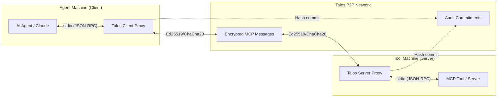

# Model Context Protocol (MCP) Integration

> **Status**: Implemented | **Code**: `src/mcp_bridge/` | **Version**: 2.0.6

> **Secure, Decentralized Transport for AI Tools**

This document details the integration of the Model Context Protocol (MCP) with the Talos Protocol. This feature allows AI Agents (like Claude, ChatGPT, etc.) to securely access local tools and resources on remote machines without relying on centralized servers or exposing public ports.

## Overview

Typically, MCP connects an AI Agent to a "Server" (tool) over `stdio` (local) or `SSE` (HTTP). 
Talos acts as a secure tunnel for the `stdio` transport. It creates a virtual connection where the Agent writes to a local "proxy" process, which encrypts and transmits the data over the **Talos P2P network** to a remote peer, where it is fed into the actual tool.

### Architecture



## Security Model

Security is inherited from the core Talos protocol:

1.  **Authentication**: Connections are only established between known peer IDs (Ed25519 public keys). The Server Proxy must explicitly allow the Client Peer ID.
2.  **Encryption**: All JSON-RPC traffic is encrypted using X25519 ECDH key exchange and ChaCha20-Poly1305.
3.  **Integrity**: Every message is signed (Ed25519) and recorded (hash only) on the local chain for non-repudiation.
4.  **Privacy**: No centralized server sees the commands or data. Traffic flows peer-to-peer.

## Components

### 1. Client Proxy (`talos mcp-connect`)

Acts as the "Transport" for the AI Agent.
- **Input**: Reads JSON-RPC requests from standard input (`stdin`).
- **Processing**: Wraps requests in `MCP_MESSAGE` protocol frames.
- **Output**: Writes JSON-RPC responses to standard output (`stdout`).
- **Error Handling**: Writes transport errors to `stderr` (invisible to the Agent's RPC parser).

### 2. Server Proxy (`talos mcp-serve`)

Host functionality for the Tools.
- **Input**: Receives `MCP_MESSAGE` frames from the network.
- **Processing**: Spawns the specified command (e.g., `uvx mcp-server-git`) as a subprocess.
- **Access Control**: Validates that the sender matches the `--authorized-peer` flag.
- **Output**: Captures subprocess `stdout` and sends back `MCP_RESPONSE` frames.

## Usage Guide

### Prerequisites

1.  **Talos Installed**: Both machines must have `talos` installed.
2.  **Identities**: Both machines must have a registered wallet (`talos init`).
3.  **Peer Connection**: Use `talos register` to discover peers via the registry (or future DHT).

### Scenario: Share a Local Git Repository

**Goal**: Allow a remote Agent to perform git operations on your machine.

**Step 1: Host Configuration (Tool Provider)**
On the machine with the git repo:
```bash
# Initialize and get your Peer ID
talos init --name "GitHost"
talos status
# Copy your Peer ID (e.g., a1b2c3...)

# Start the server, authorizing the Agent's Peer ID
talos mcp-serve \
  --authorized-peer <AGENT_PEER_ID> \
  --command "uvx mcp-server-git"
```

## 4. Generic MCP Connector Product 🔌

*New in v3.2*: Use the standalone `products/mcp-connector` tool to bridge legitimate MCP servers without writing code.

**Supported Servers**: Git, SQLite, Postgres, Ollama, Google Drive, and any stdio-based MCP server.

**Usage**:
```bash
# 1. Edit products/mcp-connector/mcp_config.yaml
# 2. Run the connector
python3 products/mcp-connector/connector.py
```

See [README](../../products/mcp-connector/README.md) for full documentation.

**Step 2: Agent Configuration (Client)**
On the machine running the AI:
```bash
# Initialize
talos init --name "MyAgent"
talos status
# Copy your Peer ID and give it to the Host

# Configure your Agent (e.g., Claude Desktop config)
# Edit ~/Library/Application Support/Claude/claude_desktop_config.json
```
```json
{
  "mcpServers": {
    "remote-git": {
      "command": "talos",
      "args": ["mcp-connect", "<HOST_PEER_ID>"]
    }
  }
}
```

**Step 3: Usage**
Restart the AI application. It will automatically spawn `talos mcp-connect`, which connects to the Host. The Host will spawn `mcp-server-git`. Any git tool usage by the AI is now securely tunneled!

## Troubleshooting

-   **Connection Timeout**: Ensure both peers are registered with the same registry server and are online.
-   **Authorization Failed**: The Host must explicitly add the Agent's full Peer ID in `--authorized-peer`.
-   **JSON Errors**: Check logs (`talos --debug ...`) to see if non-JSON data (logs/banner) is polluting `stdout`. The proxies attempt to filter this, but clean output from tools is preferred.
