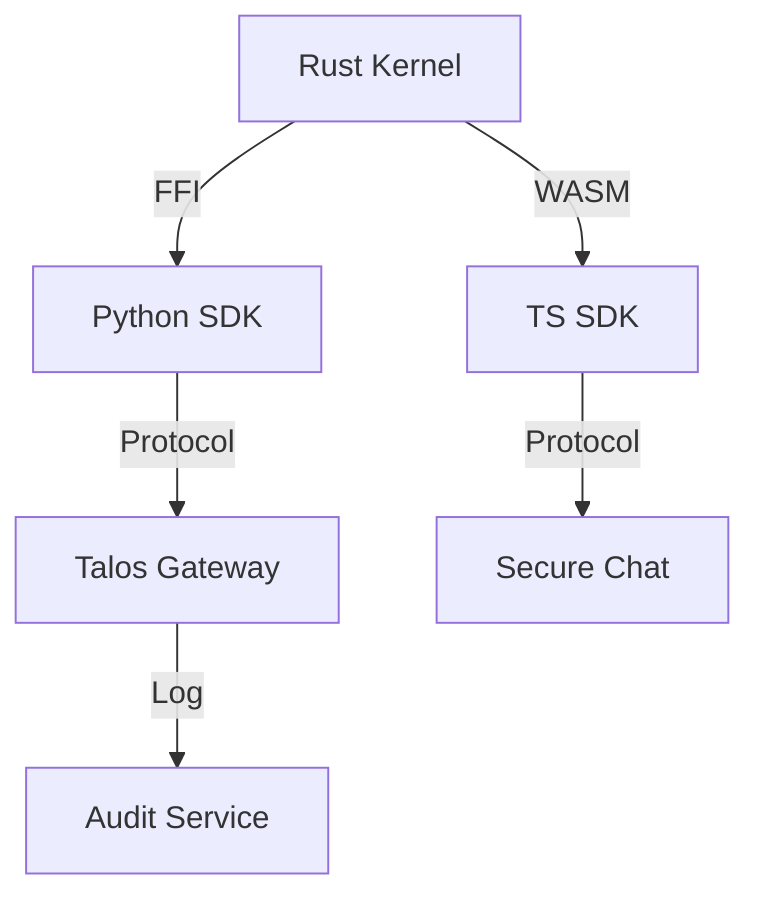

# Talos Protocol: Developer Overview

> **The Trust Layer for Autonomous AI Agents**

Talos provides the cryptographic primitives and middleware necessary to build secure, auditable, and interoperable agent systems.

## Core Primitives

### 1. Cryptographic Identity (DID)

Agents generate self-sovereign Ed25519 keypairs. All communication is signed and verifiable.

- **Spec**: `did:key:z6Mk...`
- **Implementation**: `talos-core-rs` (Rust) / `talos-sdk-ts` (WASM)

### 2. Capability Authorization

Scoped, time-limited tokens for tool access.

- **Fast Path**: < 1ms validation (stateless)
- **Slow Path**: Blockchain anchor (stateful audit)
- **Granularity**: Resource + Action (e.g., `s3:read`, `stripe:charge`)

### 3. Encrypted Transport

Double Ratchet (Signal Protocol) tunnels for forward secrecy.

- **Overhead**: < 5ms RTT (Localhost)
- **Security**: Perfect Forward Secrecy (PFS) + Break-in Recovery

## Architecture



## Integration

### 1. Model Context Protocol (MCP)

Talos sits as a middleware proxy between the LLM and the Tool.

- **Inbound**: Validates incoming Capability Token.
- **Outbound**: Signs tool execution result.

### 2. SDK Usage

```typescript
import { Agent } from "@talos-network/sdk";

const agent = await Agent.create();
const session = await agent.connect("ws://gateway:8000");
await session.sendSecure("Hello World");
```

## Performance

- **Throughput**: 695k ops/sec (Ed25519 verify, M4 Max)
- **Latency**: Sub-millisecond capability checks.

## Resources

- [GitHub Repository](https://github.com/talosprotocol/talos)
- [Documentation Wiki](https://github.com/talosprotocol/talos/wiki)
- [Examples Catalog](https://github.com/talosprotocol/talos/tree/main/examples)
