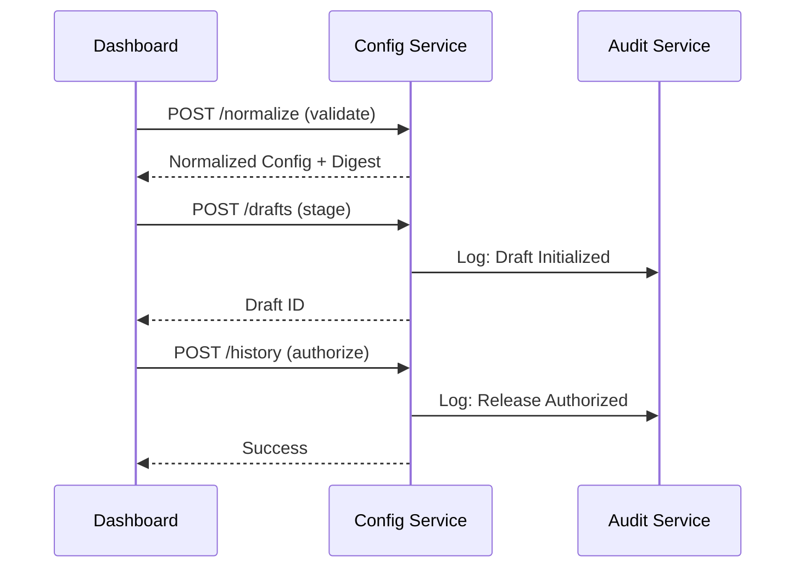

# Talos Configuration Service ⚙️

> **Production Control Plane**: The Configuration Service functions as the authoritative Backend-for-Frontend (BFF) for the Talos Control Plane. It ensures that every configuration change is validated against strict JSON schemas, normalized for cryptographic integrity, and managed through a robust draft-to-release lifecycle.

---

## 🚀 Key Features

- **Deterministic Validation**: Strict enforcement of configuration schemas defined in the `contracts` repository.
- **JCS Normalization**: Native support for **JSON Canonicalization Scheme (RFC 8785)** to enable stable cryptographic digests.
- **Release Lifecycle**: Isolated draft management with principal-based authorization tracking.
- **Immutable Audit**: Integrated with the Audit Service to log every configuration transition.
- **Version Gate**: Real-time validation of Frontend/Backend contract compatibility.

## 🏗️ Architecture

The service utilizes a lightweight **SQLite-based persistence** (Phase 11 optimized) for high-performance draft management, complemented by a **FastAPI** interface for low-latency operations.



## 🛠️ Tech Stack

- **Runtime**: Python 3.11+
- **Framework**: FastAPI
- **Persistence**: SQLite (Local Dev) / Postgres (Prod Scaled)
- **Validation**: jsonschema + Custom Contract Bridge
- **Aesthetics**: Structured logging and OTLP tracing enabled

## 💻 Development

### Setup

```bash
# Install dependencies
pip install -r requirements.txt
```

### Running Locally

```bash
uvicorn src.main:app --reload --port 8083
```

### Core API Endpoints

- `GET /health`: Service health & ready status.
- `POST /normalize`: Validate and canonicalize config blocks.
- `POST /drafts`: Stage a new configuration version.
- `GET /history`: Retrieve the immutable record of authorized releases.

## 📄 License

This service is part of the Talos Protocol and is licensed under the Apache License, Version 2.0.
