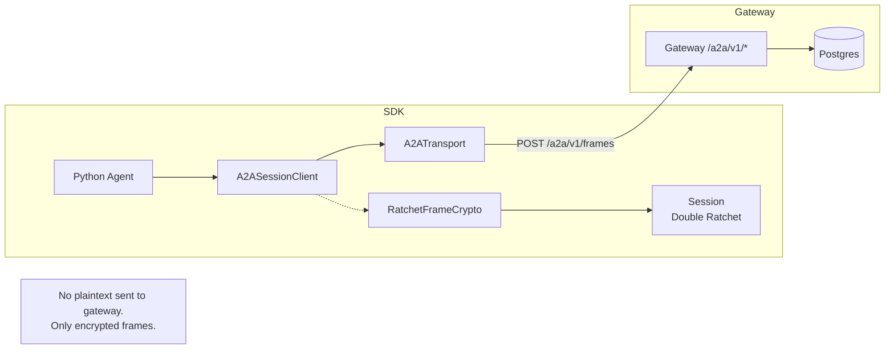

# Talos SDK for Python

<!-- TALOS_SDK_PY_VERSION: 0.1.25 -->

[](https://pypi.org/project/talos-sdk-py/)
[](LICENSE)

**Repo Role**: Reference implementation of the Talos Protocol for Python-based agents. Provides high-level secure transport primitives for Agent-to-Agent (A2A) communication.

## Abstract

The Talos SDK for Python creates a secure, encrypted tunnel for Model Context Protocol (MCP) interactions. It implements the Double Ratchet Algorithm to ensure confidentiality and integrity for autonomous agents, adhering strictly to the `talos-contracts` specification.

## Compatibility

| Component         | Version | Notes                           |
| ----------------- | ------- | ------------------------------- |
| `talos-sdk-py`    | 0.1.25  | This SDK                        |
| `talos-contracts` | ~=1.2.0 | Schema and validation           |
| Gateway           | ~=0.1.x | Must pin same contracts version |

## Module Architecture

```
talos_sdk/
├── wallet.py        # Ed25519 identity and signing
├── session.py       # Double Ratchet core (Session, SessionManager)
├── client.py        # TalosClient for gateway interaction
├── mcp.py           # MCP request signing
├── crypto.py        # Cryptographic primitives
├── canonical.py     # RFC 8785 canonical JSON
└── a2a/             # Phase 10 A2A Communication
    ├── transport.py       # HTTP transport with retry
    ├── session_client.py  # A2ASessionClient facade
    ├── ratchet_crypto.py  # RatchetFrameCrypto adapter
    ├── models.py          # Pydantic models
    ├── errors.py          # Error mapping
    └── sequence_tracker.py # Monotonic sequence tracking
```

### Phase 10 Layering

| Phase | Feature         | Description                                 |
| ----- | --------------- | ------------------------------------------- |
| 10.2  | Transport       | HTTP transport, sequencing, typed models    |
| 10.3  | Ratchet Binding | Double Ratchet encryption via `FrameCrypto` |

## System Architecture



## Usage

### Installation

```bash
pip install talos-sdk-py
```

### Transport-Only (Phase 10.2)

```python
from talos_sdk import Wallet
from talos_sdk.a2a import A2ATransport, A2ASessionClient

# Create wallet and transport
wallet = Wallet.generate(name="my-agent")
transport = A2ATransport("http://localhost:8000", wallet)

# Initiate session
client = await A2ASessionClient.initiate(transport, wallet.to_did(), "peer-did")

# Send pre-constructed frame (no encryption here)
from talos_sdk.a2a import EncryptedFrame
frame = EncryptedFrame(
    session_id=client.session_id,
    sender_id=wallet.to_did(),
    sender_seq=0,
    header_b64u="...",  # Pre-encrypted
    ciphertext_b64u="...",
    frame_digest="...",
    ciphertext_hash="...",
)
await client.send_frame(frame)
```

### Ratchet-Enabled (Phase 10.3)

```python
from talos_sdk import Wallet
from talos_sdk.session import SessionManager
from talos_sdk.a2a import A2ATransport, A2ASessionClient, RatchetFrameCrypto
from talos_sdk.crypto import generate_signing_keypair

# Setup identity and ratchet session
keypair = generate_signing_keypair()
manager = SessionManager(keypair)
ratchet_session = manager.create_session_as_initiator("peer", peer_bundle)

# Create crypto adapter
crypto = RatchetFrameCrypto(ratchet_session)

# A2A client with encryption
transport = A2ATransport("http://localhost:8000", Wallet.generate())
client = await A2ASessionClient.initiate(
    transport, "my-did", "peer-did", crypto=crypto
)

# Send encrypted message (plaintext never leaves SDK)
await client.send_message(b"Hello, secure world!")

# Receive and decrypt
messages = await client.receive_messages()
```

## Examples

See [`examples/README.md`](examples/README.md) for detailed examples:

| Example               | Description                             |
| --------------------- | --------------------------------------- |
| `quickstart.py`       | Basic wallet, client, and MCP signing   |
| `sign_mcp.py`         | MCP request signing with audit bindings |
| `a2a_messaging.py`    | A2A communication (transport + ratchet) |
| `group_management.py` | Group membership lifecycle              |

**Run an example:**

```bash
python examples/quickstart.py --gateway-url http://localhost:8000
```

## Operational Interface

| Command            | Description                                |
| ------------------ | ------------------------------------------ |
| `make test`        | Run unit tests (`pytest`)                  |
| `make conformance` | Run vector tests against `talos-contracts` |
| `scripts/test.sh`  | CI entrypoint                              |

## Security Considerations

- **Threat Model**: Passive interception, active tampering, key compromise.
- **PFS**: Compromise of current keys does not reveal past conversations.
- **Auth**: Only holders of the identity key can sign messages.
- **No Plaintext to Gateway**: All A2A frames are E2E encrypted before transmission.

## References

1. [Talos Contracts](../talos-contracts/README.md)
2. [Gateway API](../talos-ai-gateway/README.md)

## License

Licensed under the Apache License 2.0. See [LICENSE](LICENSE).
