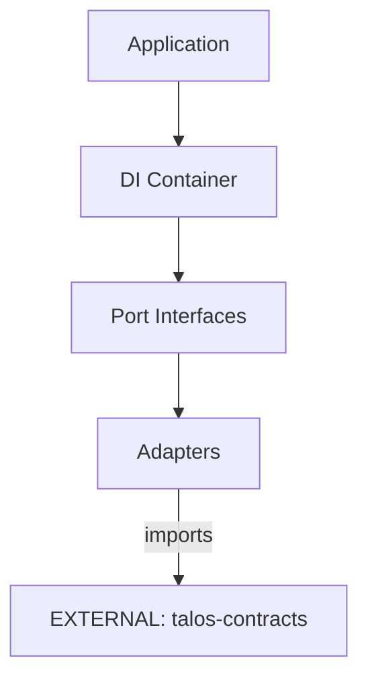

# talos-sdk-py Architecture

## Overview
`talos-sdk-py` provides the Python SDK with Ports & Adapters pattern for integrating Talos services.

## Internal Components

| Component | Purpose |
|-----------|---------|
| `talos_sdk/ports/` | Use-case port interfaces (ABC) |
| `talos_sdk/adapters/` | Concrete implementations |
| `talos_sdk/container.py` | Dependency injection container |

### Ports
- `IAuditStorePort` - Audit event persistence
- `ICryptoPort` - Cryptographic operations  
- `IHashPort` - Hashing operations
- `IKeyValueStorePort` - Generic key-value storage

### Adapters
- `InMemoryAuditStore` - Test/dev audit storage
- `Ed25519CryptoAdapter` - Ed25519 signatures
- `NativeHashAdapter` - SHA256 + canonical JSON

## External Dependencies

| Dependency | Type | Usage |
|------------|------|-------|
| `[EXTERNAL]` talos-contracts | PyPI | Cursor derivation, schemas |
| `[EXTERNAL]` talos-core-rs | Optional | High-performance crypto (future) |

## Boundary Rules
- ✅ Import helpers from `talos-contracts`, never reimplement
- ✅ All ports must be ABCs
- ❌ No direct network calls in adapters (use ports)

## Data Flow

